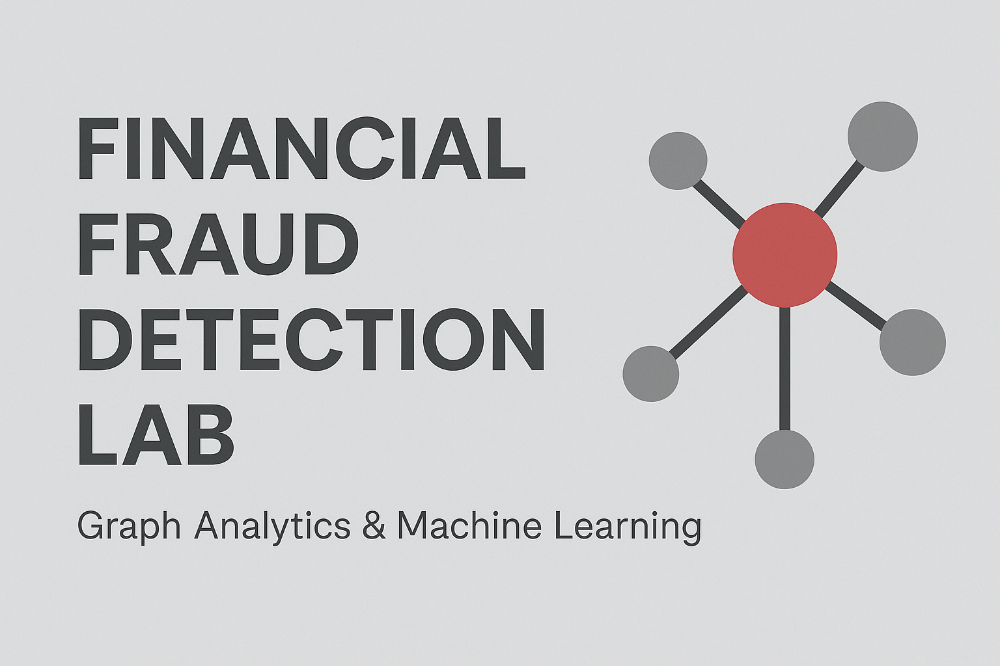

  

# Fraud Detection mit Graph Analytics & Machine Learning  
### Node2Vec • Isolation Forest • PCA • Feature Engineering • Finanztransaktionsanalyse

---

##  Projektbeschreibung

Dieses Projekt untersucht ein großes synthetisches Finanztransaktions-Dataset mit über **6,3 Millionen Transaktionen**.  
Ziel ist es, **Anomalien und potenzielle Betrugsaktivitäten** mittels

- statistischer Analyse  
- Graphenmodellierung  
- Node2Vec-Embeddings  
- Isolation Forest  
- PCA-Visualisierung  
- Feature Importance (Random Forest)

zu identifizieren.

Das Projekt kombiniert klassische Datenanalyse mit modernen Graph-Methoden und liefert eine vollständige Fraud-Detection-Pipeline.

---

## Projektstruktur

### Project:
  - erste_datei_analyse.ipynb # Grundlegende EDA & statistische Analyse
  - fin_analyse.ipynb # Graph Analytics + ML + Node2Vec
  - data/ # (optional) Beispieldaten
  - README.md # Dokumentation
  - requirements.txt # benötigte Libraries

---

## Vorgehensweise

### **1. Datenvorbereitung**
- CSV einlesen  
- Missing Values prüfen  
- dtypes analysieren  
- Duplikate entfernen  
- Statistische Grundanalyse  
- Histogramme & Verteilungen  
- Korrelationen visualisieren  

Beispiel:

df.isna().sum()

df.describe()

sns.heatmap(df.corr())

**2. Graph-Modellierung (NetworkX)**
Jede Transaktion wird als gerichtete Kante im Graphen modelliert:

Node = Kunde / Konto

Edge = Geldfluss (nameOrig -> nameDest)

Edge-Attribute: amount

G = nx.DiGraph()
for idx, row in df_sample.iterrows():
    G.add_edge(row['nameOrig'], row['nameDest'], amount=row['amount'])
    
**3. Node2Vec-Embeddings**
Um Netzwerkmuster zu erkennen, werden Kund:innen mittels Node2Vec in einen 64-dimensionalen Vektorraum eingebettet.

node2vec = Node2Vec(G_sample, dimensions=64, walk_length=30, num_walks=200)
model = node2vec.fit()
Dadurch werden ähnliche Transaktionsmuster rechnerisch vergleichbar.

**4. Anomalieerkennung (Isolation Forest)**
Die Embeddings werden anschließend mit einem IsolationForest-Modell untersucht:

clf = IsolationForest(contamination=0.01)
df_vectors['anomaly'] = clf.fit_predict(df_vectors)
 1 = normal
-1 = Anomalie

**5. Visualisierung (PCA)**
Zur Darstellung der Anomalien werden die Embeddings auf 2 Dimensionen reduziert:

pca = PCA(n_components=2)
df_vectors[['pca1', 'pca2']] = pca.fit_transform(df_vectors.drop('anomaly', axis=1))
 Klar erkennbare Outlier bilden die roten Punkte.

**6. Analyse der verdächtigen Knoten**
Top-N auffällige Kunden:
anomaly_nodes = df_vectors[df_vectors['anomaly'] == -1].index

Verteilung der Transaktionsbeträge:
- typische Peaks
- Heavy-Tail-Verhalten
- Outlier > 10⁶ z. B. bei Betrugsfällen typisch

**7. Erweiterung: Hybrid-Modell**
Kombination aus:
- Node2Vec Features
- aggregierten Kundenstatistiken (mean, count, sum)

df_combined = df_vectors.join(user_features, how='left').fillna(0)

Diese Fusion verbessert die Modellleistung erheblich.

**Beispiele für Visualisierungen**
- Histogramme der Transaktionsbeträge
- Korrelationen
- Degree-Verteilungen
- PCA-Projektion
- Isolation-Forest-Anomalien
- Feature-Importance (Random Forest)

**Verwendete Technologien**
Bereich	                  Technologie
Programmiersprache	      Python
Datenanalyse	            Pandas, NumPy
ML / Anomalieerkennung	  Scikit-Learn
Graphen	                  NetworkX, Node2Vec
Visualisierung	          Matplotlib, Seaborn
Daten	                    synthetische Finanztransaktionen

**Nutzung**
1. Repository klonen:
git clone https://github.com/DEIN_USERNAME/DEIN_REPO.git
2. Requirements installieren:
pip install -r requirements.txt
3. Notebook öffnen:
jupyter notebook
4. Notebook ausführen.  Alle Schritte sind dokumentiert.

**Ergebnisse**
- IsolationsForest erkennt klar abgrenzbare Anomalieknoten
- Node2Vec bildet erfolgreiche Kunden-Embedding-Strukturen
- PCA zeigt gut sichtbare Outlier
- Hybrides Feature-Set liefert verbesserte Modellqualität
- Kunden mit hoher Degree-Zahl sind besonders verdächtig

**Autorin**
**Natalia Archipenko**

Fachinformatikerin für Daten- und Prozessanalyse

→ Spezialisierung: ***Datenanalyse, Machine Learning, Anomalieerkennung, Zeitreihen & Graph Analytics***

LinkedIn: https://linkedin.com/in/natalia-archipenko-335357271
