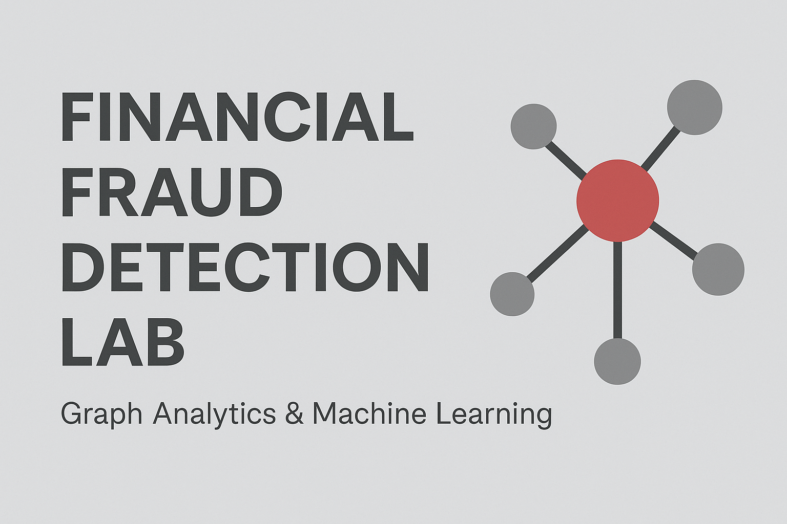

  

# Fraud Detection mit Graph Analytics and Machine Learning  

---

##  Kurzbeschreibung

Dieses Projekt analysiert ein großes synthetisches Finanztransaktions-Dataset (≈ 6,3 Mio. Transaktionen), 
um Anomalien und potenzielle Betrugsfälle mithilfe von Graph Analytics und Machine-Learning-Verfahren zu identifizieren.

Der Fokus liegt auf der Kombination klassischer Anomalieerkennung mit graphbasierten Embeddings, um komplexe Transaktionsmuster sichtbar zu machen.

---

##  Problemstellung

Finanztransaktionen bilden hochvernetzte Strukturen, in denen Betrug oft nicht durch einzelne Werte, sondern durch **Beziehungsmuster** auffällt. 
Klassische Ansätze stoßen hier schnell an Grenzen.

---

## Lösungsansatz
- Modellierung der Transaktionen als gerichteter Graph
- Erzeugung von Node-Embeddings zur Abbildung von Netzwerkstrukturen
- Anomalieerkennung auf Basis von Embeddings und aggregierten Kundenmerkmalen
- Visualisierung auffälliger Muster zur Interpretation der Ergebnisse
  
---

## Ergebnisse
- Klare Identifikation auffälliger Knoten mit ungewöhnlichen Transaktionsmustern
- Graph-Embeddings ermöglichen eine differenzierte Trennung normaler und verdächtiger Akteure
- PCA-Visualisierung zeigt deutlich abgegrenzte Anomaliecluster
- Kombination aus Netzwerk- und Statistik-Features verbessert die Modellqualität
Beispielhafte Visualisierungen sind im Repository enthalten.

---

## Technologien
- **Python:** pandas, numpy, scikit-learn
- **Graph Analytics:** NetworkX, Node2Vec
- **Visualisierung:** matplotlib, seaborn

---

## Business-Relevanz

- Frühzeitige Erkennung potenzieller Betrugsaktivitäten
- Übertragbar auf Banken, Zahlungsdienstleister und Risikomanagement-Systeme
- Besonders geeignet für Szenarien mit komplexen Transaktionsnetzwerken

---

## Autorin
**Natalia Archipenko**

LinkedIn: https://linkedin.com/in/natalia-archipenko-335357271
